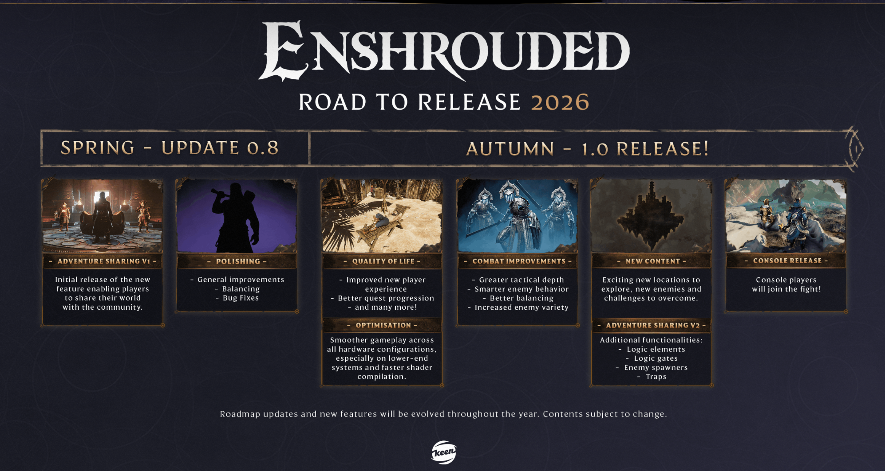

[](https://github.com/bonsaibauer/enshrouded_server_docker)

[](https://hub.docker.com/r/bonsaibauer/enshrouded_server_docker)
[](https://hub.docker.com/r/bonsaibauer/enshrouded_server_docker)
[](https://hub.docker.com/r/bonsaibauer/enshrouded_server_docker)


[](https://github.com/bonsaibauer/enshrouded_server_docker/issues/new)


<a href="https://github.com/bonsaibauer/enshrouded_server_ubuntu" target="_blank" style="display:inline-block; padding:20px 30px; background-color:#28a745; color:#ffffff; text-decoration:none; border-radius:10px; font-size:18px; font-weight:600; box-shadow:0 8px 20px rgba(0,0,0,0.2);">
  🐧 Use Ubuntu? Go to bonsaibauer/enshrouded_server_ubuntu →
</a>

# Setting Up an Enshrouded Dedicated Server with Docker: A Beginner's Guide

Embark on an adventure in the mystical world of Embervale with your own dedicated **Enshrouded** server. This guide walks you through setting up a dedicated server using **Docker**, making the process consistent and easy across different operating systems.

## Enshrouded: A Vast World of Survival and Magic

**Enshrouded** is an immersive survival action RPG set in a vast, voxel-based open world. Players must explore dangerous lands, craft for survival, and battle mystical creatures. The game supports cooperative multiplayer for up to 16 players, creating the perfect environment for shared adventures.

  
<sub>Image generated with the help of [ChatGPT](https://openai.com/chatgpt)</sub>

Road to Release — Enshrouded is slated for an Autumn 2026 launch; the roadmap below shows the milestones to release.



<details>
<summary><strong>Patch #10 v0.9.0.1 – Wake of the Water (2025-11)</strong></summary>


- Dynamically simulated water, water tools, and flooding safeguards bring bases to life.
- Veilwater Basin biome, new quests, enemies, and gear raise the progression cap to level 45.
- Fishing, greatswords, rebalanced loot, and workstation force requirements deepen crafting/combat.
- Dedicated servers now expose tags, a visitor role with terraforming limits, and improved admin tools.

</details>

### Full Settings + Example Config

- All server/gameplay fields are documented in [`docs/enshrouded_server.md`](docs/enshrouded_server.md).
- A complete sample with every setting populated ships in [`ressources/enshrouded_server.json`](ressources/enshrouded_server.json).

---

## 0. Preparing Your Environment (Prerequisites)

You can run the Enshrouded server inside a Docker container on **any operating system that supports Docker**.  
Open the section below for the supported OS matrix and prerequisites.

<details>
<summary><strong>OS matrix & prerequisites (click to expand)</strong></summary>

| Production-Ready Linux               | Desktop/Test Only                  | Notes                                                  |
|-------------------------------------|------------------------------------|--------------------------------------------------------|
| ✅ Ubuntu 24.04 LTS (recommended)   | ✅ macOS (Docker Desktop)          | ⚠️ Not suitable for hosting a live server              |
| ✅ Ubuntu 22.04 LTS                 | ✅ Windows 10/11 (WSL 2 + Docker Desktop) | ⚠️ Use for testing or development only       |
| ✅ Ubuntu 20.04 LTS                 |                                    |                                                        |
| ✅ Debian 12 / 11                   |                                    |                                                        |
| ✅ Fedora 38+                       |                                    |                                                        |
| ✅ Arch Linux                       |                                    | Rolling release — always up-to-date                    |
| ✅ AlmaLinux / Rocky Linux 9 / 8    |                                    | CentOS alternatives                                    |
| ✅ openSUSE Leap / Tumbleweed       |                                    |                                                        |

You’ll need:

- A system with Docker and Docker Compose installed
- sudo or administrative privileges
- `ufw` or firewall configuration (ensure port **15637** is open and forwarded)

> [!TIP]
> Open UDP **15637** on both your host firewall *and* your router’s port forward. This is the #1 reason friends cannot see your server.

</details>

# 1. Installing Docker (Ubuntu 24.04 and Other Linux Systems)

Docker allows you to run applications in isolated containers. It's ideal for deploying an Enshrouded dedicated server because it ensures consistency, portability, and easy management.

This guide will walk you through installing Docker on Ubuntu 24.04. These steps also work on most other Linux distributions with minor adjustments.

### Step 1: Update Your Package Index

Before installing anything, update your system to ensure all packages are current.

`Debian/Ubuntu`
```
sudo apt update && sudo apt upgrade -y
```
- `sudo apt update`: Refreshes the package index.
- `sudo apt upgrade -y`: Upgrades installed packages automatically.

> `Fedora`
> ```
> sudo dnf upgrade --refresh
> ```
> 
> `Arch Linux`
> ```
> sudo pacman -Syu
> ```

### Step 2: Install Required Dependencies

Docker relies on a few helper packages. Install them with:

```bash
sudo apt install apt-transport-https ca-certificates curl software-properties-common lsb-release gnupg -y
```

- `apt-transport-https`: Allows `apt` to use HTTPS.
- `ca-certificates`: Ensures your system trusts SSL certificates.
- `curl`: Command-line tool for downloading files.
- `software-properties-common`: Adds support for `add-apt-repository`.
- `lsb-release`: Provides OS version info.
- `gnupg`: Required for managing GPG keys.

### Step 3: Add Docker’s Official GPG Key

Docker signs its packages for security. Add their GPG key:

```bash
curl -fsSL https://download.docker.com/linux/ubuntu/gpg | sudo gpg --dearmor -o /usr/share/keyrings/docker-archive-keyring.gpg
```

### Step 4: Add Docker’s APT Repository

Configure your system to use Docker’s stable software repository:

```bash
echo   "deb [arch=$(dpkg --print-architecture) signed-by=/usr/share/keyrings/docker-archive-keyring.gpg]   https://download.docker.com/linux/ubuntu   $(lsb_release -cs) stable" | sudo tee /etc/apt/sources.list.d/docker.list > /dev/null
```

### Step 5: Install Docker Engine

Update your package index again and install Docker:

```bash
sudo apt update
sudo apt install docker-ce docker-ce-cli containerd.io -y
```

- `docker-ce`: Docker Community Edition
- `docker-ce-cli`: Docker command-line interface
- `containerd.io`: Container runtime used by Docker

Verify Docker is running:

```bash
sudo systemctl status docker
```

Press `q` to exit the status screen.

# 2. Create User and Working Directory

Persisting game data outside the container keeps saves and configs safe. Create a dedicated host user and set the correct permissions.

### Step 1: Add the service user and data folder

```bash
sudo useradd -m -r -s /bin/false enshrouded
sudo mkdir -p /home/enshrouded
```
- `useradd`: Add a user.
  - `-m`: Create the home directory if missing.
  - `-r`: Mark as a system account (no password expiry).
  - `-s /bin/false`: Disable interactive logins.
  - `enshrouded`: Account that owns server data.
- `mkdir -p /home/enshrouded`
  - `-p`: Create parent directories if they do not exist.
  - `/home/enshrouded`: Host path for persistent saves/configs.

### Step 2: Grant default ACLs for host access

```bash
sudo setfacl -R -d -m u:enshrouded:rwx /home/enshrouded
sudo setfacl -R -d -m u:$(whoami):rwx /home/enshrouded
```
- `setfacl`: Manage POSIX ACL entries (extra permissions beyond owner/group/others).
  - `-R`: Recurse into subdirectories.
  - `-d`: Set defaults for newly created files/dirs.
  - `-m`: Modify/add entries.
  - `u:enshrouded:rwx`: Grant read/write/execute to host user `enshrouded`.
  - `u:$(whoami):rwx`: Grant the same to the current shell user.
- The container writes as user `steam` (see `Dockerfile`); ACLs let host users manage files without changing ownership.

### Step 3 (Optional): Allow Docker without sudo

```bash
sudo usermod -aG docker enshrouded
sudo usermod -aG docker $(whoami)
```
- `usermod`: Change account properties.
  - `-aG`: Append to supplementary group(s) without removing existing ones.
  - `docker`: Group that allows running Docker without `sudo`.
- Log out/in after adding to pick up the new group membership.

# 3. Quickstart

If you prefer not to build the image yourself, you can run the **official prebuilt Docker image** directly from Docker Hub. This is the fastest and easiest way to get your server up and running.

Change into your data directory before starting the container:

```bash
cd /home/enshrouded/server_1
```

```bash
docker run \
  --name enshroudedserver \
  --restart=unless-stopped \
  -p 15637:15637/udp \
  -v /home/enshrouded/server_1:/home/steam/enshrouded \
  bonsaibauer/enshrouded_server_docker:latest
```
- `--name enshroudedserver`: Assign your container name here.
- `--restart=unless-stopped`: Automatically restarts after crash/reboot until you stop it.
- `-p 15637:15637/udp`: Default Enshrouded UDP port; change if you configured a different port.
- `-v /home/enshrouded/server_1:/home/steam/enshrouded`: Mounts the data directory on the host.
---

Wait until you see the following logs to confirm it's running:
```bash
[Session] 'HostOnline' (up)!
[Session] finished transition from 'Lobby' to 'Host_Online' (current='Host_Online')!
```

To exit the log view safely and keep the server running, press:
```bash
Ctrl + C
```

---

# 4. Edit server configuration
> 🔧 This file is located in the mounted directory:
> `/home/enshrouded/server_1/enshrouded_server.json`

```bash
nano enshrouded_server.json
```

Edit the `enshrouded_server.json` file to configure your server settings.

---

### General Server Settings

| Setting            | Description                                | Example / Default Value | Options / Notes          |
|--------------------|--------------------------------------------|--------------------------|---------------------------|
| **name**           | Name of the server                         | "Enshrouded Server"      | Any string                |
| **saveDirectory**  | Directory where savegames are stored       | "./savegame"             | File path                 |
| **logDirectory**   | Directory for log files                    | "./logs"                 | File path                 |
| **ip**             | Server IP binding                          | "0.0.0.0"                | Server ip adress          |
| ...                | ...                                        | ...                      | ...                       |

... [View full server settings here](https://github.com/bonsaibauer/enshrouded_server_docker/blob/main/docs/enshrouded_server.md)

> **ℹ️ Note: Nano editor**
>
> After editing the `enshrouded_server.json` file, follow these steps to save your changes and exit the Nano editor:
>
> 1. **Save**:
>    - Press `CTRL + O` (this means "Write Out").
>    - Press `Enter` to confirm and save the file with the current name.
>
> 2. **Exit**:
>    - Press `CTRL + X` to close the Nano editor.
>
> You will then return to the regular command line.

# 5. Docker commands to manage Enshrouded Server
## Start the Enshrouded Server

If the container has already been created (e.g. from a previous `docker run`), you can start it again with:

```bash
docker start enshroudedserver
```

## Stop the Enshrouded Server

To safely stop the server without deleting the container:

```bash
docker stop enshroudedserver
```

## Update the Enshrouded Server

To restart the container (stop and start again):

```bash
docker restart enshroudedserver
```

## Stop and remove the container
   ```bash
   docker stop enshroudedserver
   docker rm enshroudedserver
   ```

## View live logs

Follow the server logs in real time (use `Ctrl+C` to leave log view; the container keeps running):

```bash
docker logs -f enshroudedserver
```

## Buy Me A Coffee
If this project has helped you in any way, do buy me a coffee so I can continue to build more of such projects in the future and share them with the community!

<a href="https://buymeacoffee.com/bonsaibauer" target="_blank"></a>

