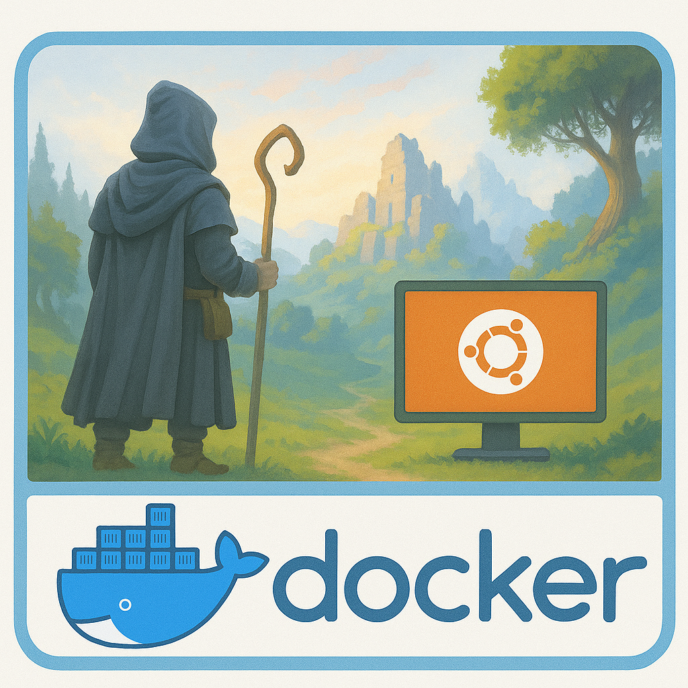

[](https://github.com/bonsaibauer/enshrouded_server_docker)

[](https://hub.docker.com/r/bonsaibauer/enshrouded_server_docker)
[](https://hub.docker.com/r/bonsaibauer/enshrouded_server_docker)
[](https://hub.docker.com/r/bonsaibauer/enshrouded_server_docker)

[](https://github.com/bonsaibauer/enshrouded_server_docker/issues/new)


# Setting Up an Enshrouded Dedicated Server with Docker: A Beginner's Guide

Embark on an adventure in the mystical world of Embervale with your own dedicated **Enshrouded** server. This guide walks you through setting up a dedicated server using **Docker**, making the process consistent and easy across different operating systems.

## Enshrouded: A Vast World of Survival and Magic

**Enshrouded** is an immersive survival action RPG set in a vast, voxel-based open world. Players must explore dangerous lands, craft for survival, and battle mystical creatures. The game supports cooperative multiplayer for up to 16 players, creating the perfect environment for shared adventures.

  
<sub>Image generated with the help of [ChatGPT](https://openai.com/chatgpt)</sub>

---

## 0. Preparing Your Environment

### Prerequisites

You can run the Enshrouded server inside a Docker container on **any operating system that supports Docker**, including but not limited to:

| Production-Ready Linux               | Desktop/Test Only                  | Notes                                                  |
|-------------------------------------|------------------------------------|--------------------------------------------------------|
| ✅ Ubuntu 24.04 LTS (recommended)   | ✅ macOS (Docker Desktop)          | ⚠️ Not suitable for hosting a live server              |
| ✅ Ubuntu 22.04 LTS                 | ✅ Windows 10/11 (WSL 2 + Docker Desktop) | ⚠️ Use for testing or development only       |
| ✅ Ubuntu 20.04 LTS                 |                                    |                                                        |
| ✅ Debian 12 / 11                   |                                    |                                                        |
| ✅ Fedora 38+                       |                                    |                                                        |
| ✅ Arch Linux                       |                                    | Rolling release — always up-to-date                    |
| ✅ AlmaLinux / Rocky Linux 9 / 8    |                                    | CentOS alternatives                                    |
| ✅ openSUSE Leap / Tumbleweed       |                                    |                                                        |

You’ll need:

- A system with Docker and Docker Compose installed
- sudo or administrative privileges
- `ufw` or firewall configuration (ensure port **15637** is open and forwarded)

# 1. Installing Docker (Ubuntu 22.04 and Other Linux Systems)

Docker allows you to run applications in isolated containers. It's ideal for deploying an Enshrouded dedicated server because it ensures consistency, portability, and easy management.

This guide will walk you through installing Docker on Ubuntu 22.04. These steps also work on most other Linux distributions with minor adjustments.

### Step 1: Update Your Package Index

Before installing anything, update your system to ensure all packages are current.

`Debian/Ubuntu`
```
sudo apt update && sudo apt upgrade -y
```
- `sudo apt update`: Refreshes the package index.
- `sudo apt upgrade -y`: Upgrades installed packages automatically.

`Fedora`
```
sudo dnf upgrade --refresh
```

`Arch Linux`
```
sudo pacman -Syu
```
### Step 2: Install Required Dependencies

Docker relies on a few helper packages. Install them with:

```bash
sudo apt install apt-transport-https ca-certificates curl software-properties-common lsb-release gnupg -y
```

- `apt-transport-https`: Allows `apt` to use HTTPS.
- `ca-certificates`: Ensures your system trusts SSL certificates.
- `curl`: Command-line tool for downloading files.
- `software-properties-common`: Adds support for `add-apt-repository`.
- `lsb-release`: Provides OS version info.
- `gnupg`: Required for managing GPG keys.

### Step 3: Add Docker’s Official GPG Key

Docker signs its packages for security. Add their GPG key:

```bash
curl -fsSL https://download.docker.com/linux/ubuntu/gpg | sudo gpg --dearmor -o /usr/share/keyrings/docker-archive-keyring.gpg
```

### Step 4: Add Docker’s APT Repository

Configure your system to use Docker’s stable software repository:

```bash
echo   "deb [arch=$(dpkg --print-architecture) signed-by=/usr/share/keyrings/docker-archive-keyring.gpg]   https://download.docker.com/linux/ubuntu   $(lsb_release -cs) stable" | sudo tee /etc/apt/sources.list.d/docker.list > /dev/null
```

### Step 5: Install Docker Engine

Update your package index again and install Docker:

```bash
sudo apt update
sudo apt install docker-ce docker-ce-cli containerd.io -y
```

- `docker-ce`: Docker Community Edition
- `docker-ce-cli`: Docker command-line interface
- `containerd.io`: Container runtime used by Docker

Verify Docker is running:

```bash
sudo systemctl status docker
```

Press `q` to exit the status screen.

# 2. Create user and working directory

To allow the Docker container to persist game data and configurations, we create a dedicated system user and set up the correct directory.

Run these commands as root or with `sudo`:

```bash
# Create a system user 'enshrouded' without login shell
sudo useradd -m -r -s /bin/false enshrouded

# Ensure the home directory exists
sudo mkdir -p /home/enshrouded

# Set proper ownership
sudo chown -R enshrouded:enshrouded /home/enshrouded
```

> 🛡️ This ensures that the container can write to `/home/enshrouded` and all server data stays in one clean location.

# 3. Download the repository

Change to the working directory:

```bash
cd /home/enshrouded
```

Clone the project from GitHub:

```bash
sudo git clone https://github.com/bonsaibauer/enshrouded_server_docker.git
cd enshrouded_server_docker
```

(Optional) Adjust ownership:

```bash
sudo chown -R enshrouded:enshrouded .
```

# 4. Edit server configuration

Edit the `enshrouded_server.json` file to configure your server:
- You can edit this configuration file to control the number of players and set a password for the server.
- Set the server IP (important!), server name, password, and slot count as desired.

```bash
nano enshrouded_server.json
```

---

### General Server Settings

| Setting            | Description                                | Example / Default Value | Options / Notes          |
|--------------------|--------------------------------------------|--------------------------|---------------------------|
| **name**           | Name of the server                         | "Enshrouded Server"      | Any string                |
| **saveDirectory**  | Directory where savegames are stored       | "./savegame"             | File path                 |
| **logDirectory**   | Directory for log files                    | "./logs"                 | File path                 |
| **ip**             | Server IP binding                          | "0.0.0.0"                | Server ip adress          |
| ...                | ...                                        | ...                      | ...                       |

... [View full server settings here](https://github.com/bonsaibauer/enshrouded_server_docker/blob/main/enshrouded_server.md)

# 5. Build the Docker image

Run the following command in the project directory:

```bash
docker build -t enshrouded-server .
```

This builds the image using the provided Dockerfile which includes SteamCMD, downloads the server, and sets up the environment.

# 6. Start the server

Launch the container:

```bash
docker run -d \
  --name enshrouded \
  -p 15636:15636/udp \
  -v /home/enshrouded:/home/enshrouded \
  enshrouded-server
```

# 🚧 Work in Progress 😊
.
.
.
.
.

## Buy Me A Coffee
If this project has helped you in any way, do buy me a coffee so I can continue to build more of such projects in the future and share them with the community!

<a href="https://buymeacoffee.com/bonsaibauer" target="_blank"></a>
