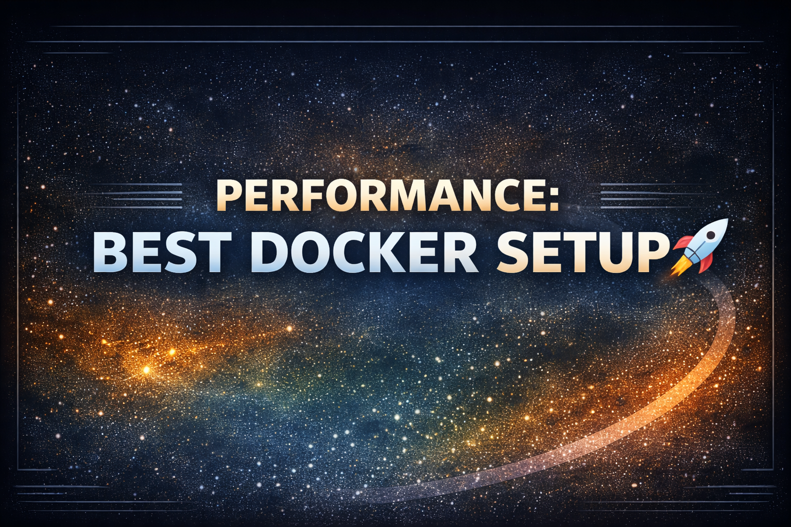

[](https://github.com/bonsaibauer)
[](https://github.com/bonsaibauer/enshrouded_server_docker)


[](https://hub.docker.com/r/bonsaibauer/enshrouded_server_docker)
[](https://hub.docker.com/r/bonsaibauer/enshrouded_server_docker)
[](https://hub.docker.com/r/bonsaibauer/enshrouded_server_docker)


[](https://github.com/bonsaibauer/enshrouded_server_docker/issues/new)



# Enshrouded Dedicated Server Docker - Introduction

> [!TIP]
> 🔥 **HELLO FLAMEBORN** 🔥  
> Start fast, stay stable, and spend your time playing instead of fixing server drama.

> [!TIP]
> 🧠 **Supervisor Foundation Credit**  
> The Supervisor-based core approach in this project is based on ideas from [`mornedhels/enshrouded-server`](https://github.com/mornedhels/enshrouded-server). Big respect for the groundwork.

This introduction is for players who want a strong Enshrouded server setup without becoming full-time Docker admins.  
You launch the container, open the menu, and the server manager handles updates, restarts, backups, profile switching, validation, and process control.

## Why People Use This Setup

You get one clean workflow instead of scattered scripts and manual fixes. This stack manages two config areas in one place:

- **Enshrouded Server settings**: gameplay/world settings like slots, ports, rules, tags, and user groups (`enshrouded_server.json`).
- **Server Manager settings**: automation/operations like backup behavior, restart schedules, update checks, cron sync, hooks, and runtime handling (`server_manager.json`).

Profiles and backup/restore are built on top of these two layers, so you can switch setups and recover fast without manual file surgery.

> [!TIP]
> 🎛️ Open the control center with: `docker exec -it enshroudedserver server menu`

## Feature Breakdown (Simple + Powerful) ⚡

- **Menu (`server menu`)**: Your all-in-one control center for start, stop, restart, update, profile apply/reset, backup, and restore, plus editing both Enshrouded gameplay settings and Server Manager automation settings.
- **Supervisor**: Orchestrates jobs like `server`, `updater`, `backup`, `restart`, `bootstrap`, and `cron` for predictable behavior, better uptime, and cleaner recovery.
- **Backup + Restore**: Manual and scheduled backups, backup listing/inspection, component-level restore (savegame only, Enshrouded config only, Manager config only), or full recovery with optional safety backup before restore.
- **GE-Proton Runtime**: Uses current **GE-Proton** (default: **GE-Proton 10-28**) for strong compatibility and stable long-running performance, combined with controlled restart/update flows, player-aware checks, and safe stop grace.

## Command + Feature Roadmap

> [!NOTE]
> Status legend: `✅ Live` = available now, `🟡 In Progress` = currently being built, `⚪ Not Yet` = planned idea.

<details>
<summary><strong>Open Feature Roadmap</strong></summary>

| Command | Description | Roadmap Status |
|---|---|---|
| `menu` | Opens the interactive control center for daily server management. | ✅ Live |
| `status` | Shows supervisor state for jobs like `server`, `updater`, `backup`, and `cron`. | ✅ Live |
| `start` / `stop` | Starts or stops the game server safely. | ✅ Live |
| `restart` | Controlled restart flow with downtime handling. | ✅ Live |
| `scheduled-restart` | Runs the same restart logic used by cron schedules. | ✅ Live |
| `restart player-check` | Restarts only when no players are online (player-aware safety). | ✅ Live |
| `update` | Normal update flow with SteamCMD integration. | ✅ Live |
| `update check` | Checks if an update is available without installing it. | ✅ Live |
| `update force` | Forces a clean update path. | ✅ Live |
| `backup` | Creates a manual backup archive. | ✅ Live |
| `backup list` | Lists available backup archives. | ✅ Live |
| `backup inspect <zip>` | Shows what is inside a backup archive before restore. | ✅ Live |
| `backup restore <zip> [target]` | Restores full backup or only selected components. | ✅ Live |
| `backup-config` | Creates config-only backup without savegame data. | ✅ Live |
| `profile <manager\|enshrouded> <apply\|reset>` | Applies or resets profile-based server configurations. | ✅ Live |
| `password-view` | Displays user-group password/rights information from config. | ✅ Live |
| `cron sync` | Rebuilds cron entries from current runtime config. | ✅ Live |
| `env-validation verify` | Validates env values and setup consistency. | ✅ Live |
| `hook-run` | Runs custom hook commands for automation workflows. | ✅ Live |
| `profile packs` | Ready-made profile packs for different playstyles. | 🟡 In Progress |
| `dashboard` | Optional browser-based admin panel experience. | ⚪ Not Yet |
| `notify` | Built-in notification channel integration (e.g., webhook/Discord style). | ⚪ Not Yet |

</details>

# 1. Installing Docker (Ubuntu 24.04 and Other Linux Systems)

Docker allows you to run applications in isolated containers. It's ideal for deploying an Enshrouded dedicated server because it ensures consistency, portability, and easy management.

This guide will walk you through installing Docker on Ubuntu 24.04. These steps also work on most other Linux distributions with minor adjustments.

### Step 1: Update Your Package Index

Before installing anything, update your system to ensure all packages are current.

`Debian/Ubuntu`
```
sudo apt update && sudo apt upgrade -y
```
- `sudo apt update`: Refreshes the package index.
- `sudo apt upgrade -y`: Upgrades installed packages automatically.

> `Fedora`
> ```
> sudo dnf upgrade --refresh
> ```
> 
> `Arch Linux`
> ```
> sudo pacman -Syu
> ```

### Step 2: Install Required Dependencies

Docker relies on a few helper packages. Install them with:

```bash
sudo apt install apt-transport-https ca-certificates curl software-properties-common lsb-release gnupg -y
```

> - `apt-transport-https`: Allows `apt` to use HTTPS.
> - `ca-certificates`: Ensures your system trusts SSL certificates.
> - `curl`: Command-line tool for downloading files.
> - `software-properties-common`: Adds support for `add-apt-repository`.
> - `lsb-release`: Provides OS version info.
> - `gnupg`: Required for managing GPG keys.

### Step 3: Add Docker’s Official GPG Key

Docker signs its packages for security. Add their GPG key:

```bash
curl -fsSL https://download.docker.com/linux/ubuntu/gpg | sudo gpg --dearmor -o /usr/share/keyrings/docker-archive-keyring.gpg
```

### Step 4: Add Docker’s APT Repository

Configure your system to use Docker’s stable software repository:

```bash
echo   "deb [arch=$(dpkg --print-architecture) signed-by=/usr/share/keyrings/docker-archive-keyring.gpg]   https://download.docker.com/linux/ubuntu   $(lsb_release -cs) stable" | sudo tee /etc/apt/sources.list.d/docker.list > /dev/null
```

### Step 5: Install Docker Engine

Update your package index again and install Docker:

```bash
sudo apt update
sudo apt install docker-ce docker-ce-cli containerd.io -y
```

> - `docker-ce`: Docker Community Edition
> - `docker-ce-cli`: Docker command-line interface
> - `containerd.io`: Container runtime used by Docker

Verify Docker is running:

```bash
sudo systemctl status docker
```

Press `q` to exit the status screen.

# 2. Create user and working directory

To allow the Docker container to persist game data and configurations, we create a dedicated system user and set up the correct directory.

Run these commands as root or with `sudo`:

Create the system user:

```bash
sudo useradd -m -r -s /bin/false enshrouded
```
> `useradd -m -r -s /bin/false enshrouded`: creates a system user with a home directory and no login shell.

Ensure the home directory exists:

```bash
sudo mkdir -p /home/enshrouded/server_1
```
> `mkdir -p /home/enshrouded/server_1`: creates the persistent data directory.

Set proper ownership:

```bash
sudo chown -R enshrouded:enshrouded /home/enshrouded/server_1
```
> `chown -R enshrouded:enshrouded /home/enshrouded/server_1`: assigns ownership to the enshrouded user (recursive so existing files are fixed too).

Ensure group write access:

```bash
sudo chmod -R u+rwX,g+rwX /home/enshrouded/server_1
```
> `chmod -R u+rwX,g+rwX /home/enshrouded/server_1`: ensures logs/saves are writable by the mapped user and group.

Add the current login user to the enshrouded group (same access as enshrouded):

```bash
sudo usermod -aG enshrouded "${SUDO_USER:-$USER}"
```
> `usermod -aG enshrouded "${SUDO_USER:-$USER}"`: grants the current login user the same access as enshrouded.

Allow the enshrouded user to run docker without sudo:

```bash
sudo usermod -aG docker enshrouded
```
> `usermod -aG docker enshrouded`: lets enshrouded run docker without sudo.

Apply group changes without logging out:

```bash
newgrp enshrouded
newgrp docker
```
> `newgrp enshrouded` / `newgrp docker`: applies group changes in the current session (each opens a new shell; run the one you need, or open a new terminal for the other).

> 🛡️ This ensures that the container can write to `/home/enshrouded/server_1` and all server data stays in one clean location.
> PUID/PGID are required at container start to map the internal user to your host `enshrouded` user.


# 3. Quickstart
## Step 1: Go to ...
```bash
cd /home/enshrouded/server_1
```

Start the container:

```bash
docker run \
  --name enshroudedserver \
  --restart=unless-stopped \
  --stop-timeout 90 \
  -p 15637:${ENSHROUDED_QUERY_PORT:=15637}/udp \
  -e PUID="$(id -u enshrouded)" \
  -e PGID="$(id -g enshrouded)" \
  -e ENSHROUDED_QUERY_PORT \
  -v /home/enshrouded/server_1:/home/enshrouded/server \
  bonsaibauer/enshrouded_server_docker:dev_latest
```
--- 

## Step 2: (not necessary)

<details>
<summary><strong>Visual guide (changeable parts marked with <>):</strong></summary>

```bash
docker run \
  --name <container_name> \
  --restart=unless-stopped \
  -p <host_port>:15637/udp \
  -e PUID="$(id -u enshrouded)" \
  -e PGID="$(id -g enshrouded)" \
  -e EN_PROFILE="<profile>" \
  -e MANAGER_PROFILE="<profile>" \
  -e ENSHROUDED_NAME="<server_name>" \
  -e ENSHROUDED_ROLE_0_PASSWORD="<admin_password>" \
  -v <host_path>:/home/steam/enshrouded \
  bonsaibauer/enshrouded_server_docker:<tag>
```

Common adjustments:

| Item | Example |
| --- | --- |
| `--name <container_name>` | `--name enshroudedserver` |
| `--restart=unless-stopped` | Keeps the container running across reboots and crashes (e.g. `no`, `on-failure`, `always`, `unless-stopped`). |
| `-p <host_port>:15637/udp` | `-p 25000:15637/udp` (external UDP 25000) |
| `-e PUID/PGID` | In this tutorial: `-e PUID=$(id -u enshrouded) -e PGID=$(id -g enshrouded)`; you can also set them individually, e.g. `-e PUID=1001 -e PGID=1001`. |
| `-e EN_PROFILE` | `-e EN_PROFILE=default` (applied only when `enshrouded_server.json` is created for the first time). |
| `-e MANAGER_PROFILE` | `-e MANAGER_PROFILE=default` (profile is copied to `/server_manager/server_manager.json` when missing or a stub). |
| `-e ENSHROUDED_NAME` | `-e ENSHROUDED_NAME="My Enshrouded Server"` |
| `-e ENSHROUDED_ROLE_0_PASSWORD` | `-e ENSHROUDED_ROLE_0_PASSWORD="MyAdminPassword"` |
| `-v <host_path>:/home/steam/enshrouded` | `-v /srv/enshrouded:/home/steam/enshrouded` |
| `bonsaibauer/enshrouded_server_docker:<tag>` | `bonsaibauer/enshrouded_server_docker:latest` (see [Docker Hub tags](https://hub.docker.com/r/bonsaibauer/enshrouded_server_docker/tags)) |
</details>

---

Wait until you see the following logs to confirm it's running:
```bash
[Session] 'HostOnline' (up)!
[Session] finished transition from 'Lobby' to 'Host_Online' (current='Host_Online')!
```

To exit the log view safely and keep the server running, press:
```bash
Ctrl + C
```

---

# 4. Edit server configuration
> 🔧 This file is located in the mounted directory:
> `/home/enshrouded/server_1/enshrouded_server.json`

```bash
nano enshrouded_server.json
```

Edit the `enshrouded_server.json` file to configure your server settings.

---

### General Server Settings

| Setting            | Description                                | Example / Default Value | Options / Notes          |
|--------------------|--------------------------------------------|--------------------------|---------------------------|
| **name**           | Name of the server                         | "Enshrouded Server"      | Any string                |
| **saveDirectory**  | Directory where savegames are stored       | "./savegame"             | File path                 |
| **logDirectory**   | Directory for log files                    | "./logs"                 | File path                 |
| **ip**             | Server IP binding                          | "0.0.0.0"                | Server ip adress          |
| ...                | ...                                        | ...                      | ...                       |

... [View full server settings here](https://github.com/bonsaibauer/enshrouded_server_docker/blob/main/docs/enshrouded_server.md)

> **ℹ️ Note: Nano editor**
>
> After editing the `enshrouded_server.json` file, follow these steps to save your changes and exit the Nano editor:
>
> 1. **Save**:
>    - Press `CTRL + O` (this means "Write Out").
>    - Press `Enter` to confirm and save the file with the current name.
>
> 2. **Exit**:
>    - Press `CTRL + X` to close the Nano editor.
>
> You will then return to the regular command line.

# 5. Docker commands to manage Enshrouded Server
## Start the Enshrouded Server

If the container has already been created (e.g. from a previous `docker run`), you can start it again with:

```bash
docker start enshroudedserver
```

## Stop the Enshrouded Server

To safely stop the server without deleting the container:

```bash
docker stop enshroudedserver
```

## Update the Enshrouded Server

To restart the container (stop and start again):

```bash
docker restart enshroudedserver
```

## Stop and remove the container
   ```bash
   docker stop enshroudedserver
   docker rm enshroudedserver
   ```

## View live logs

Follow the server logs in real time (use `Ctrl+C` to leave log view; the container keeps running):

```bash
docker logs -f enshroudedserver
```

## Buy Me A Coffee
If this project has helped you in any way, do buy me a coffee so I can continue to build more of such projects in the future and share them with the community!

<a href="https://buymeacoffee.com/bonsaibauer" target="_blank"></a>


