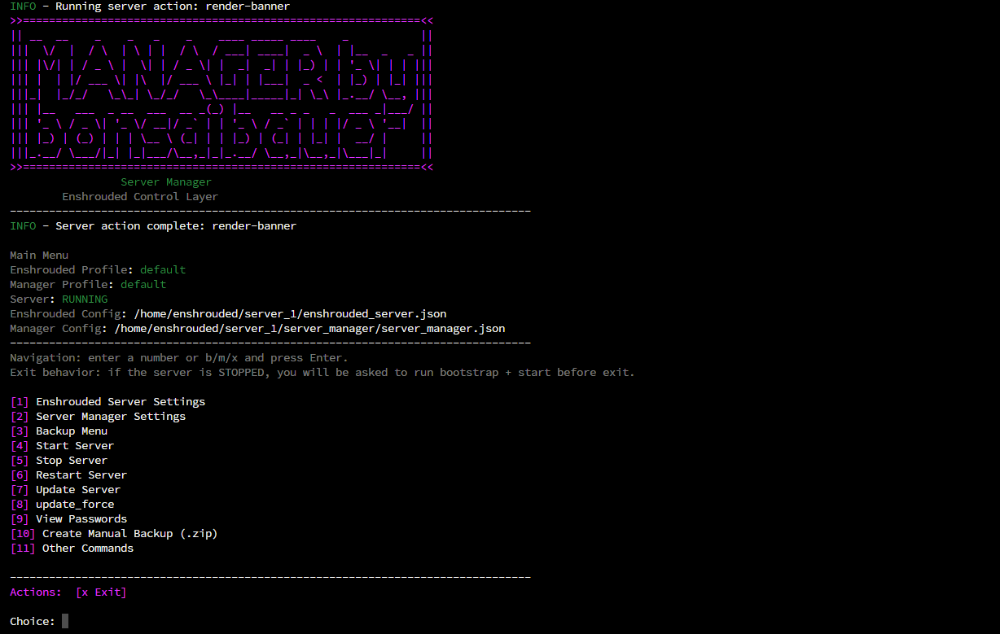

[](https://github.com/bonsaibauer)
[](https://github.com/bonsaibauer/enshrouded_server_docker)

[](https://hub.docker.com/r/bonsaibauer/enshrouded_server_docker)
[](https://hub.docker.com/r/bonsaibauer/enshrouded_server_docker)

[](https://hub.docker.com/r/bonsaibauer/enshrouded_server_docker)

[](https://github.com/bonsaibauer/enshrouded_server_docker/issues/new)


# Enshrouded Dedicated Server Docker

> [!NOTE]
> 🔥 **HELLO FLAMEBORN** 🔥  
> Start fast, stay stable, and spend your time playing instead of fixing server drama.
> 
> 🧠 **Supervisor Foundation Credit**  
> The Supervisor-based core approach in this project is based on ideas from [`mornedhels/enshrouded-server`](https://github.com/mornedhels/enshrouded-server). Big respect for the groundwork.


## Why People Use This Setup

You get one clean workflow instead of scattered scripts and manual fixes. This stack manages two config areas in one place:

- **Enshrouded Server settings**: gameplay/world settings like slots, ports, rules, tags, and user groups (`enshrouded_server.json`).
- **Server Manager settings**: automation/operations like backup behavior, restart schedules, update checks, cron sync, hooks, and runtime handling (`server_manager.json`).

> [!TIP]
> 🎛️ Open the control center with: `docker exec -it enshroudedserver menu`

## Feature Breakdown (Simple + Powerful) ⚡

- **Menu (`server menu`)**: Your all-in-one control center for start, stop, restart, update, profile apply/reset, backup, and restore, plus editing both Enshrouded gameplay settings and Server Manager automation settings.
- **Supervisor**: Orchestrates jobs like `server`, `updater`, `backup`, `restart`, `bootstrap`, and `cron` for predictable behavior, better uptime, and cleaner recovery.
- **Backup + Restore**: Manual and scheduled backups, backup listing/inspection, component-level restore (savegame only, Enshrouded config only, Manager config only), or full recovery with optional safety backup before restore.
- **GE-Proton Runtime**: Uses current **GE-Proton** (default: **GE-Proton 10-30**) for strong compatibility and stable long-running performance, combined with controlled restart/update flows, player-aware checks, and safe stop grace.

## Command + Feature Roadmap

> [!NOTE]
> Status legend: `✅ Live` = available now, `🟡 In Progress` = currently being built, `⚪ Not Yet` = planned idea.

<details>
<summary><strong>Open Feature Roadmap</strong></summary>

| Command | Description | Roadmap Status |
|---|---|---|
| `menu` | Opens the interactive control center for daily server management. | ✅ Live |
| `status` | Shows supervisor state for jobs like `server`, `updater`, `backup`, and `cron`. | ✅ Live |
| `start` / `stop` | Starts or stops the game server safely. | ✅ Live |
| `restart` | Controlled restart flow with downtime handling. | ✅ Live |
| `scheduled-restart` | Runs the same restart logic used by cron schedules. | ✅ Live |
| `restart player-check` | Restarts only when no players are online (player-aware safety). | ✅ Live |
| `update` | Normal update flow with SteamCMD integration. | ✅ Live |
| `update check` | Checks if an update is available without installing it. | ✅ Live |
| `update force` | Forces a clean update path. | ✅ Live |
| `backup` | Creates a manual backup archive. | ✅ Live |
| `backup list` | Lists available backup archives. | ✅ Live |
| `backup inspect <zip>` | Shows what is inside a backup archive before restore. | ✅ Live |
| `backup restore <zip> [target]` | Restores full backup or only selected components. | ✅ Live |
| `backup-config` | Creates config-only backup without savegame data. | ✅ Live |
| `profile <manager\|enshrouded> <apply\|reset>` | Applies or resets profile-based server configurations. | ✅ Live |
| `password-view` | Displays user-group password/rights information from config. | ✅ Live |
| `cron sync` | Rebuilds cron entries from current runtime config. | ✅ Live |
| `env-validation verify` | Validates env values and setup consistency. | ✅ Live |
| `hook-run` | Runs custom hook commands for automation workflows. | ✅ Live |
| `profile packs` | Ready-made profile packs for different playstyles. | 🟡 In Progress |
| `dashboard` | Optional browser-based admin panel experience. | ⚪ Not Yet |
| `notify` | Built-in notification channel integration (e.g., webhook/Discord style). | ⚪ Not Yet |

</details>

--- 

# 1. Installing Docker (Ubuntu 24.04 and Other Linux Systems)

Docker allows you to run applications in isolated containers. It's ideal for deploying an Enshrouded dedicated server because it ensures consistency, portability, and easy management.

This guide will walk you through installing Docker on Ubuntu 24.04. These steps also work on most other Linux distributions with minor adjustments.

### Step 1: Update Your Package Index

Before installing anything, update your system to ensure all packages are current.

`Debian/Ubuntu`
```
sudo apt update && sudo apt upgrade -y
```
- `sudo apt update`: Refreshes the package index.
- `sudo apt upgrade -y`: Upgrades installed packages automatically.

> `Fedora`
> ```
> sudo dnf upgrade --refresh
> ```
> 
> `Arch Linux`
> ```
> sudo pacman -Syu
> ```

### Step 2: Install Required Dependencies

Docker relies on a few helper packages. Install them with:

```bash
sudo apt install apt-transport-https ca-certificates curl software-properties-common lsb-release gnupg -y
```

> - `apt-transport-https`: Allows `apt` to use HTTPS.
> - `ca-certificates`: Ensures your system trusts SSL certificates.
> - `curl`: Command-line tool for downloading files.
> - `software-properties-common`: Adds support for `add-apt-repository`.
> - `lsb-release`: Provides OS version info.
> - `gnupg`: Required for managing GPG keys.

### Step 3: Add Docker’s Official GPG Key

Docker signs its packages for security. Add their GPG key:

```bash
curl -fsSL https://download.docker.com/linux/ubuntu/gpg | sudo gpg --dearmor -o /usr/share/keyrings/docker-archive-keyring.gpg
```

### Step 4: Add Docker’s APT Repository

Configure your system to use Docker’s stable software repository:

```bash
echo   "deb [arch=$(dpkg --print-architecture) signed-by=/usr/share/keyrings/docker-archive-keyring.gpg]   https://download.docker.com/linux/ubuntu   $(lsb_release -cs) stable" | sudo tee /etc/apt/sources.list.d/docker.list > /dev/null
```

### Step 5: Install Docker Engine

Update your package index again and install Docker:

```bash
sudo apt update
sudo apt install docker-ce docker-ce-cli containerd.io -y
```

> - `docker-ce`: Docker Community Edition
> - `docker-ce-cli`: Docker command-line interface
> - `containerd.io`: Container runtime used by Docker

Verify Docker is running:

```bash
sudo systemctl status docker
```

Press `q` to exit the status screen.

# 2. Create user and working directory

To allow the Docker container to persist game data and configurations, we create a dedicated system user and set up the correct directory.

Run these commands as root or with `sudo`:

Create the system user and directory:

```bash
sudo useradd -m -r -s /bin/false enshrouded
sudo mkdir -p /home/enshrouded/server_1
```
> `useradd -m -r -s /bin/false enshrouded`: creates a system user with a home directory and no login shell.
> `mkdir -p /home/enshrouded/server_1`: creates the persistent data directory.

Set proper ownership:

```bash
sudo chown -R enshrouded:enshrouded /home/enshrouded/server_1
sudo chmod -R u+rwX,g+rwX /home/enshrouded/server_1
```
> `chown -R enshrouded:enshrouded /home/enshrouded/server_1`: assigns ownership to the enshrouded user (recursive so existing files are fixed too).
> `chmod -R u+rwX,g+rwX /home/enshrouded/server_1`: ensures logs/saves are writable by the mapped user and group.

Add the current login user to the enshrouded group (same access as enshrouded):

```bash
sudo usermod -aG enshrouded "${SUDO_USER:-$USER}"
sudo usermod -aG docker enshrouded
newgrp enshrouded
newgrp docker
```
> `usermod -aG enshrouded "${SUDO_USER:-$USER}"`: grants the current login user the same access as enshrouded.
> `usermod -aG docker enshrouded`: lets enshrouded run docker without sudo.
> 
> `newgrp enshrouded` / `newgrp docker`: applies group changes in the current session (each opens a new shell; run the one you need, or open a new terminal for the other).
> 
> 🛡️ This ensures that the container can write to `/home/enshrouded/server_1` and all server data stays in one clean location.

--- 

# 2. Deploy and Start docker container

## Step 1: Go to ...
```bash
cd /home/enshrouded/server_1
```

## Step 2: Quickstart Deploy and run Docker Image

```bash
docker run \
  --name enshroudedserver \
  --restart=unless-stopped \
  --stop-timeout 90 \
  -p 15637:${ENSHROUDED_QUERY_PORT:=15637}/udp \
  -e PUID="$(id -u enshrouded)" \
  -e PGID="$(id -g enshrouded)" \
  -e EN_PROFILE="default" \
  -e MANAGER_PROFILE="default" \
  -e ENSHROUDED_QUERY_PORT \
  -e ENSHROUDED_NAME="My Enshrouded Server" \
  -v /home/enshrouded/server_1:/home/enshrouded/server \
  bonsaibauer/enshrouded_server_docker:dev_latest
```

> [!TIP]
> Need to look up and set more ENV-Values?
> - Server Manager settings documentation: [`docs/server_manager.md`](docs/server_manager.md)
> - Enshrouded Server settings documentation: [`docs/enshrouded_server.md`](docs/enshrouded_server.md)

<details>
<summary><strong>Visual guide (changeable parts marked with &lt;&gt;):</strong></summary>

```bash
docker run \
  --name <container_name> \
  --restart=unless-stopped \
  --stop-timeout 90 \
  -p <host_query_port>:${ENSHROUDED_QUERY_PORT:=15637}/udp \
  -e PUID="$(id -u enshrouded)" \
  -e PGID="$(id -g enshrouded)" \
  -e EN_PROFILE="<enshrouded_profile>" \
  -e MANAGER_PROFILE="<manager_profile>" \
  -e ENSHROUDED_QUERY_PORT="${ENSHROUDED_QUERY_PORT}" \
  -e ENSHROUDED_NAME="<server_name>" \
  -v <host_path>:/home/enshrouded/server \
  bonsaibauer/enshrouded_server_docker:<tag>
```

Common adjustments:

| Item | Example |
| --- | --- |
| `--name <container_name>` | `--name enshroudedserver` |
| `--restart=unless-stopped` | Keeps the container running across reboots and crashes (e.g. `no`, `on-failure`, `always`, `unless-stopped`). |
| `--stop-timeout 90` | Waits up to 90 seconds for a clean shutdown before force-kill. |
| `-p <host_query_port>:${ENSHROUDED_QUERY_PORT:=15637}/udp` | `-p 25000:${ENSHROUDED_QUERY_PORT:=15637}/udp` (external UDP 25000, internal query port defaults to 15637). |
| `-e PUID/PGID` | In this tutorial: `-e PUID=$(id -u enshrouded) -e PGID=$(id -g enshrouded)`; you can also set them directly, e.g. `-e PUID=1001 -e PGID=1001`. |
| `-e EN_PROFILE` | `-e EN_PROFILE=default` (selects Enshrouded profile template on first bootstrap for fresh/missing config). |
| `-e MANAGER_PROFILE` | `-e MANAGER_PROFILE=default` (selects Server Manager profile template on first bootstrap for fresh/missing config). |
| `-e ENSHROUDED_QUERY_PORT` | `-e ENSHROUDED_QUERY_PORT=15637` (must match the internal port in `-p ...:<internal>/udp`). |
| `-e ENSHROUDED_NAME` | `-e ENSHROUDED_NAME="My Enshrouded Server"` (server name shown in the in-game server browser). |
| `-v <host_path>:/home/enshrouded/server` | `-v /home/enshrouded/server_1:/home/enshrouded/server` |
| `bonsaibauer/enshrouded_server_docker:<tag>` | `bonsaibauer/enshrouded_server_docker:dev_latest` (or `latest`; see [Docker Hub tags](https://hub.docker.com/r/bonsaibauer/enshrouded_server_docker/tags)). |

</details>

<details>
<summary><strong>Profiles Explained</strong></summary>

### Profiles Explained

> [!TIP]
> Super easy start:
> 1. Set `EN_PROFILE=default`
> 2. Set `MANAGER_PROFILE=default`
> 3. Start the container
>
> That's it. The first config files are created automatically.

> [!NOTE]
> You have 2 profile switches:
> - `EN_PROFILE=<name>` chooses the Enshrouded template file.
> - `MANAGER_PROFILE=<name>` chooses the Server Manager template file.

> [!TIP]
> Right now, only `default` is shipped for both profile selectors.
> Use these for now:
> - `EN_PROFILE=default`
> - `MANAGER_PROFILE=default`
>
> You can still change gameplay and automation directly:
> - ENV-Difficulty: `ENSHROUDED_GS_PRESET=Default|Relaxed|Hard|Survival|Custom`
> - Auto backups: `BACKUP_CRON` + `BACKUP_MAX_COUNT`

> [!IMPORTANT]
> - Profiles are mostly used on first start (or when config files are missing).
> - If a profile name is wrong, `default` is used.
> - If `EN_PROFILE` / `MANAGER_PROFILE` are fixed via container env, menu apply/reset for profiles is locked.

### Current Template (`server_manager.json`)

| Selector | Current value | Template file |
| --- | --- | --- |
| `MANAGER_PROFILE` | `default` | [`default_server_manager.json`](server_manager/profiles/manager/default_server_manager.json) |

### Current Template (`enshrouded_server.json`)

| Selector | Current value | Template file |
| --- | --- | --- |
| `EN_PROFILE` | `default` | [`default_enshrouded_server.json`](server_manager/profiles/enshrouded/default_enshrouded_server.json) |

... [View full server settings here](docs/enshrouded_server.md)  
... [View full server manager settings here](docs/server_manager.md)  
... [Read full profile docs here](docs/profile.md)

</details>

---

Wait until you see the following logs to confirm it's running:
```bash
[Session] 'HostOnline' (up)!
[Session] finished transition from 'Lobby' to 'Host_Online' (current='Host_Online')!
```

To exit the log view safely and keep the server running, press:
```bash
Ctrl + C
```

> [!TIP]
> If you want to get started quickly, you can view the generated in-game server passwords with:

```bash
docker exec enshroudedserver profile passwords
```

---

# 3. Edit server configuration

## Option 3.1: Use the built-in control center (recommended)

> [!TIP]
> 🎛️ Open the control center with: `docker exec -it enshroudedserver menu`

`menu.png` (selection menu):



<details>
<summary><strong>Detailed summary: What you get in the selection menu</strong></summary>

1. `Enshrouded Server Settings`
> - `Edit current settings`: edits `enshrouded_server.json` directly (including `gameSettings` and `userGroups`).
> - `Reset current profile`: resets the active config to the currently selected profile.
> - `Select and apply profile`: selects a profile and applies it to the active config.
> - `Manage Banned Accounts`: shows merged banned entries (`bannedAccounts` + legacy `bans`) and supports `deban`/unban (removes from both arrays).

2. `Server Manager Settings`
> - `Edit current settings`: edits `server_manager/server_manager.json` directly.
> - `Reset current profile` and `Select and apply profile`: same flow as above, but for manager config.

3. `Backup Menu`
> - Restore from ZIP, manual full backup, config backup.

4. `Start/Stop/Restart/Update/update_force/View Passwords/Create Manual Backup`
> - Direct quick actions without changing menus.

5. `Other Commands`
> - `status`, `scheduled-restart`, `bootstrap`, `cron sync`.

> [!TIP]
> Navigation and behavior:
> - Enter by number, `b` (back), `m` (main menu), `x` (exit).
> - `[ENV]` marks fields controlled by container environment variables, which may be locked in the editor.
> - If the server is stopped when you exit, the menu offers the combined `bootstrap + start` flow.

</details>

## Option 3.2: Edit config files directly in the shell terminal

Stop the server before editing config files:

```bash
docker exec enshroudedserver stop
```

## A) Edit `enshrouded_server.json`

> 🔧 This file is located in the mounted directory:  
> `/home/enshrouded/server_1/enshrouded_server.json`

```bash
cd /home/enshrouded/server_1
nano enshrouded_server.json
```

Edit the `enshrouded_server.json` file to configure gameplay/world settings.

### General Server Settings

| Setting | Description | Example / Default Value | Options / Notes |
|--------------------|--------------------------------------------|--------------------------|---------------------------|
| **name** | Name of the server | "Enshrouded Server" | Any string |
| **saveDirectory** | Directory where savegames are stored | "./savegame" | File path |
| **logDirectory** | Directory for log files | "./logs" | File path |
| **ip** | Server IP binding | "0.0.0.0" | Server IP address |
| ... | ... | ... | ... |

... [View full server settings here](docs/enshrouded_server.md)

## B) Edit `server_manager/server_manager.json`

> 🔧 This file is located in the mounted directory:  
> `/home/enshrouded/server_1/server_manager/server_manager.json`

```bash
cd /home/enshrouded/server_1
nano server_manager/server_manager.json
```

Edit the `server_manager/server_manager.json` file to configure automation/operations settings.

### General Server Manager Settings

| Setting | Description | Example / Default Value | Options / Notes |
|--------------------|--------------------------------------------|--------------------------|---------------------------|
| **puid** | Runtime UID for container user mapping | 4711 | Integer >= 1 |
| **pgid** | Runtime GID for container user mapping | 4711 | Integer >= 1 |
| **MANAGER_PROFILE** | Selected Server Manager profile name | "default" | Profile selector |
| **EN_PROFILE** | Selected Enshrouded profile name | "default" | Profile selector |
| ... | ... | ... | ... |

... [View full server manager settings here](docs/server_manager.md)

> **ℹ️ Note: Nano editor**
>
> After editing either JSON file, follow these steps to save your changes and exit the Nano editor:
>
> 1. **Save**: Press `CTRL + O`, then press `Enter` to confirm.
> 2. **Exit**: Press `CTRL + X` to close Nano.
>
> You will then return to the regular command line.

Apply changes (`bootstrap + start` via `docker exec`):

```bash
docker exec enshroudedserver bootstrap
docker exec enshroudedserver start
```

# 4. Docker Commands

- `docker logs -f enshroudedserver`: Follows recent container logs live.
- `docker start enshroudedserver`: Starts the existing container.
- `docker stop enshroudedserver`: Stops the container with a safe 90s grace period.
- `docker restart enshroudedserver`: Restarts the container with graceful shutdown behavior.
- `docker rm enshroudedserver`: Removes the stopped container.


# 5. Server Manager Commands (Quick Readme)

> [!TIP]
> 🎛️ Open the control center with: `docker exec -it enshroudedserver menu`
>
> Full command reference: [`docs/commands.md`](docs/commands.md)

- `docker exec enshroudedserver help`: Shows built-in command overview from the server dispatcher.
- `docker exec enshroudedserver status`: Shows supervisor status for all jobs (`server`, `updater`, `crond`, ...).
- `docker exec -it enshroudedserver menu`: Opens the interactive management menu.
- `docker exec enshroudedserver start`: Starts the server job.
- `docker exec enshroudedserver stop`: Stops the server job.
- `docker exec enshroudedserver restart`: Runs the restart job with defaults from `server_manager.json`.
- `docker exec enshroudedserver update`: Runs normal updater flow (install if needed, then start server).
- `docker exec enshroudedserver update force`: Forces full update path.
- `docker exec enshroudedserver backup`: Creates a manual backup with default includes (savegame + both config files).
- `docker exec enshroudedserver backup list`: Lists available backup ZIP files (manual + scheduled).
- `docker exec enshroudedserver backup inspect <backup.zip>`: Shows which components are in a backup ZIP.
- `docker exec enshroudedserver backup restore <backup.zip> [savegame|enshrouded|manager|all]`: Restores selected parts (default target is `all`).
- `docker exec enshroudedserver profile <manager|enshrouded> <apply|reset> [profile]`: Applies/resets profile (with config backup).
- `docker exec enshroudedserver profile passwords [text|json]`: Alias for `password-view` with the same output formats.
- `docker exec enshroudedserver password-view`: Shows user group rights/passwords.
- `docker exec enshroudedserver cron sync`: Rewrites cron table from current `server_manager.json`.
- `docker exec enshroudedserver cron [start|stop|restart|status]`: Controls `crond` service.

## Buy Me A Coffee
If this project has helped you in any way, do buy me a coffee so I can continue to build more of such projects in the future and share them with the community!

<a href="https://buymeacoffee.com/bonsaibauer" target="_blank"></a>
